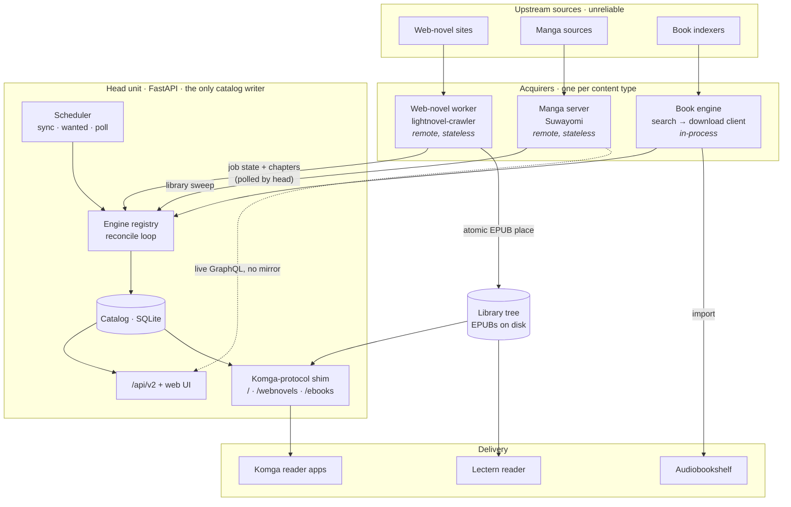
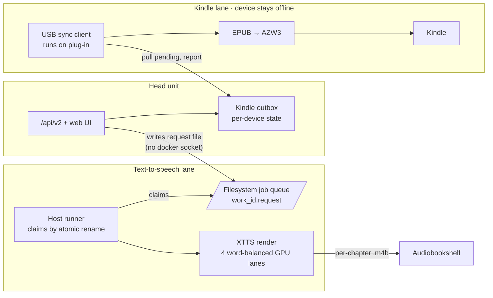

# Scriptorium

**A head/worker backend for keeping a personal library of growing works complete
against unreliable sources.**

Todd Odell · A.A.S. Computer Science, Maestro College · 2026

Scriptorium is a self-hosted backend that tracks serialized web fiction, manga and
ebooks, keeps each work current as new chapters are published, and delivers the
result to existing reader apps, an audiobook server, and an offline Kindle. In development since June
2026, its production deployment holds about 1,050 works and 110,000
chapters.

This repository is a **showcase**: it presents the design, the API and a few
representative algorithms. The full source is private.

## Architecture

The head owns the catalog and is its only writer. Acquisition is delegated per
content type: web novels and manga go to stateless worker containers over a small
HTTP contract, books run in-process. A worker can crash or be rebuilt with no
catalog loss; the next poll re-reports the truth and the head reconciles.



Two side lanes turn what the library already holds into other formats. Neither one
lets the head push anything: GPU renders are requested through a filesystem job
queue instead of a docker socket, and Kindles are only reached by a USB client
that pulls from an outbox.



## Read

**[The white paper](WHITEPAPER.md)** covers:
- the architecture (a single-writer head plus stateless workers);
- the reconcile algorithms;
- serving reader apps by emulating another server's API;
- a filesystem job queue used as a security boundary;
- an evaluation on the live system, including a case study of diagnosing a
  throughput collapse.

## Browse

| Path | Contents |
|---|---|
| [api/openapi-v2.json](api/openapi-v2.json) | OpenAPI 3.1 description of the `/api/v2` surface (24 operations). Paste into [editor.swagger.io](https://editor.swagger.io) to explore. |
| [excerpts/worker_contract.py](excerpts/worker_contract.py) | The head/worker HTTP protocol, as pydantic models (paper section 5.1) |
| [excerpts/watermark.py](excerpts/watermark.py) | Contiguous chapter watermark and two-run dead-gap detection (section 5.3) |
| [excerpts/shard_partition.py](excerpts/shard_partition.py) | Optimal contiguous partition for parallel text-to-speech lanes (section 7.2) |
| [excerpts/test_excerpts.py](excerpts/test_excerpts.py) | Tests for the excerpts, including a brute-force optimality check |

```bash
pip install pytest pydantic
pytest excerpts/
```

## Stack

Python 3.12 · FastAPI · SQLModel/SQLAlchemy (async SQLite) · Alembic · APScheduler ·
Jinja2 · WebAuthn passkeys · Docker · GitHub Actions

## License

All rights reserved. Published for reading and discussion; see [LICENSE](LICENSE).
