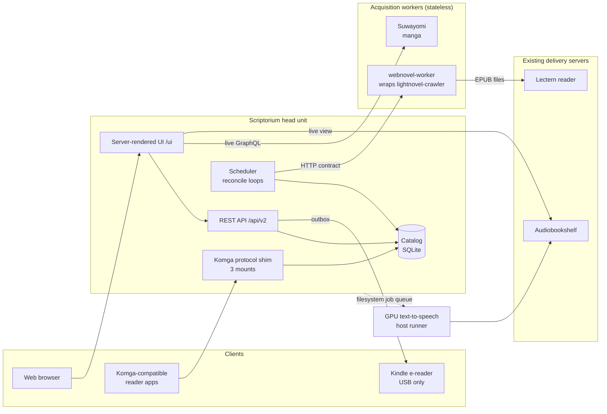
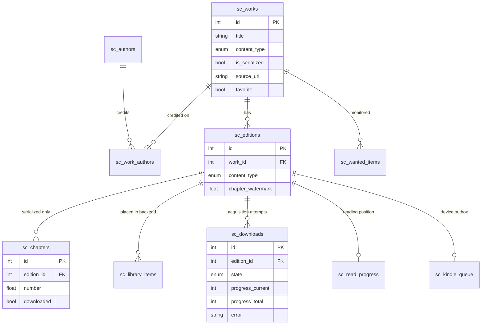
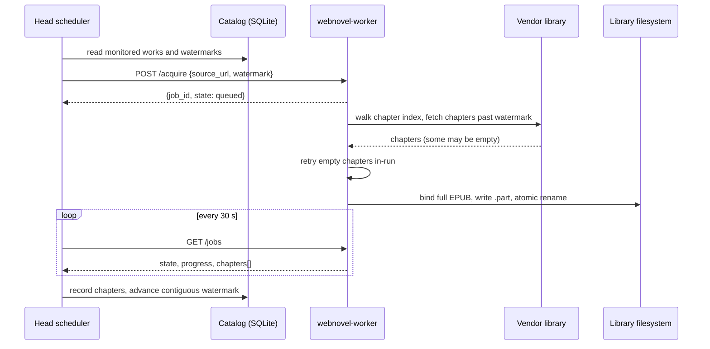
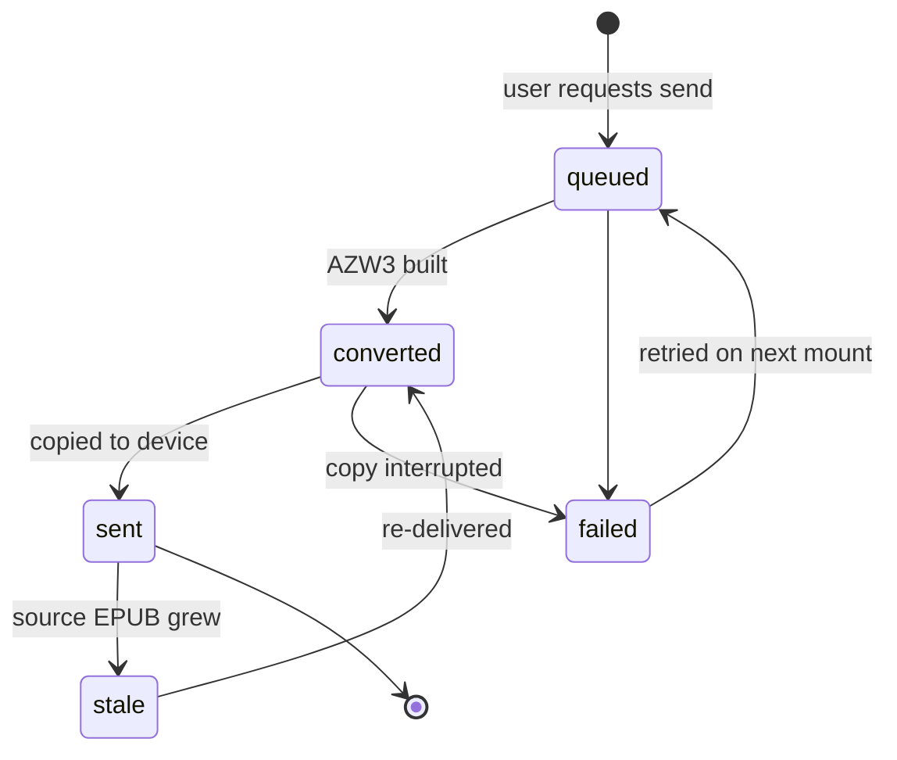

# Scriptorium: A Head/Worker Architecture for Reconciling a Personal Text-Media Library Against Unreliable Sources

**Todd Odell**
Associate of Applied Science, Computer Science · Maestro College

*White paper · September 2026 · describes source revision at 93 commits, schema revision `0004_kindle_queue`*

---

## Abstract

Personal media servers such as Komga, Kavita and Audiobookshelf are built around a
static assumption: a book is a file, and a file, once imported, does not change.
Serialized web fiction violates that assumption daily. A single web novel can gain
several chapters a day for years, its source can throttle or vanish, and the
readers that consume it silently lose a user's place whenever the underlying file is
rewritten. This paper presents **Scriptorium**, a self-hosted backend that treats a
growing work as a first-class object. Scriptorium separates a **head unit**, which
alone owns the catalog and every write to it, from stateless **acquisition workers**
that each wrap one third-party vendor behind a small HTTP contract. A periodic
reconcile loop drives each monitored work toward its source using a *contiguous
chapter watermark*, and a two-run confirmation rule distinguishes chapters that are
permanently missing at the source from ones that failed transiently. On the
delivery side, the head speaks the Komga REST protocol directly from its own
catalog, which lets it report truthful modification times that the file-based server
could not. We describe the architecture, its data model and algorithms, and evaluate
it against a production deployment holding 1,050 works and 110,364 chapter records.
A case study of a throughput collapse in September 2026 shows a
16-fold recovery in chapter throughput after the root cause, a leaked semaphore in a
vendor library, was isolated from a misleading rate-limiting hypothesis. We close
with the generalizable lessons: silent failure modes dominate in integration-heavy
systems, a single-writer rule is a sufficient isolation guarantee, and a stall of
constant duration is a timeout, not a rate limit.

---

## 1. Introduction

A reader who follows web fiction accumulates a library with three uncomfortable
properties. First, **works are mutable**: the unit of value is a chapter, not a book,
and the book grows for as long as the author writes. Second, **sources are
unreliable**: the sites that publish chapters rate-limit aggressive clients, change
their markup without notice, and occasionally serve empty or truncated pages that are
indistinguishable, at the HTTP layer, from success. Third, **the library is
fragmented across specialized servers**: manga lives in one application, audiobooks
in another, retail ebooks in a third, and each has its own notion of what exists.

Existing tools address pieces of this. The "*arr" family of media managers (Sonarr
for television, Readarr for books) established a durable pattern of *monitored
items*, *indexers* and *import*, but models books as immutable releases [1]. Media
servers such as Komga [2] and Audiobookshelf [3] serve files well but assume those
files are stable. Scraping libraries such as lightnovel-crawler [4] can fetch a novel,
but have no notion of a library, of what is already owned, or of what changed.

Scriptorium began as a downloader and grew into a **routing layer between systems that
already exist**: it is the single component that knows what the user owns, what they
want, and what changed since last time. This paper makes the following
contributions:

1. A **head/worker decomposition on the vendor axis**, in which a single writer owns
   all catalog state and each third-party dependency is isolated in a replaceable,
   stateless container (Section 3).
2. A **contiguous-watermark reconcile algorithm** with two-run dead-gap
   confirmation, which keeps a growing work complete without ever skipping a chapter
   that failed only transiently (Section 5.3).
3. **Protocol emulation as a delivery strategy**: serving an existing client
   ecosystem by implementing its server's API over a different data model, learned by
   traffic capture, which enabled behavior the original server could not provide
   (Section 6.1).
4. A **filesystem job queue** as a security boundary between a web-facing container
   and privileged GPU work, where the allow-list is a property of the message format
   rather than a filter (Section 7.1).
5. A **measured evaluation** on a production deployment, including a
   root-cause case study of a throughput collapse (Section 9).

---

## 2. Background and Related Work

**Media managers.** Sonarr, Radarr and Readarr share an architecture in which the user
*monitors* an item, an *indexer* is searched for releases, a *download client*
retrieves one, and an *importer* files it into the library [1]. Scriptorium adopts this
vocabulary (its tables are named `wanted_items`, `downloads` and `library_items`)
but departs from it in one essential way: a Readarr release is complete on arrival,
while a Scriptorium web novel is never complete. The monitored unit is therefore a
*position* in a growing sequence rather than a missing file.

**Media servers.** Komga [2] and Kavita index a directory tree of comic and ebook
archives and expose them over REST and OPDS to a family of third-party reader
applications. Audiobookshelf [3] does the same for audio. All three derive their state
from the filesystem, so a file that is rewritten in place looks, to the server, like
the same book, and to many clients, like a book whose reading position is no longer
valid.

**Scraping engines.** lightnovel-crawler (lncrawl) [4] provides per-site parsers for
several hundred web-fiction sources and stores fetched chapters in its own SQLite
database. Suwayomi [5] provides the equivalent for manga, with a GraphQL API. Both are
large, fast-moving dependencies with their own failure modes, which motivates
isolating them (Section 3).

**Reconciliation.** The acquisition design borrows from the controller pattern
popularized by Kubernetes [6]: rather than issuing imperative commands, a loop
repeatedly compares desired state (the work should contain every chapter the source
lists) with observed state (the chapters the catalog holds) and acts to close the
difference. The practical benefit is that recovery from any failure is simply the
next iteration of the loop.

---

## 3. System Overview

### 3.1 Design principles

Four principles recur throughout the design and are referred to by name in later
sections.

- **P1, Single writer.** The head is the only process that writes the catalog
  database. Workers hold no catalog state and can be rebuilt from an empty volume
  with no catalog loss.
- **P2, Fail loud rather than truncate.** When a source returns less than expected,
  the system raises an error rather than recording a smaller truth. A failed update
  is recoverable on the next iteration; a truncated book is not.
- **P3, Prefer reversible representations.** Where two representations are possible,
  choose the one that can be converted into the other (per-chapter audio files can
  be concatenated; a monolith cannot be split).
- **P4, Measure, do not estimate.** Every operating figure in this paper was measured
  on the live deployment; design decisions cite measurements rather than
  expectations.

### 3.2 Components

Figure 1 shows the deployed system. The head unit is a single FastAPI [7]
application. Acquisition is delegated to workers over HTTP; delivery is federated to
existing servers or served directly.



*Figure 1. System context. Solid arrows are network calls; the dotted arrow is a
filesystem-mediated boundary (Section 7.1).*

The head is a merge of two codebases. An earlier scrape engine, `omni_dl`, owns the
`/ui` surface and a legacy scraping pipeline; the newer `scriptorium` package owns the
unified catalog, the worker layer and the `/api/v2` surface. The earlier code was kept
and reused rather than rewritten, and the two coexist behind one process.

### 3.3 Technology

| Concern | Choice | Rationale |
|---|---|---|
| Language | Python 3.12 | Ecosystem of the vendor libraries being wrapped |
| Web framework | FastAPI, Uvicorn | Async I/O for many concurrent upstream calls; OpenAPI for free |
| ORM | SQLModel over SQLAlchemy (async, aiosqlite) | One class serves as table, validator and DTO |
| Migrations | Alembic, guarded | Section 4.3 |
| Scheduling | APScheduler | In-process interval loops, no broker |
| UI | Jinja2, server-rendered | No build step, no frontend framework |
| Auth | WebAuthn passkeys (stdlib implementation), Argon2 | Section 8 |
| Packaging | Docker; JVM sidecar for one manga provider | Single deployable image per component |

The head has 23 direct dependencies. The Python codebase is 21,553 lines across 164
files, of which 9,239 lines are the `scriptorium` package itself.

---

## 4. Data Model

### 4.1 The catalog graph

The catalog is one SQLite database. All unified tables carry an `sc_` prefix and
coexist with the legacy engine's tables. Figure 2 shows the core relationships.



*Figure 2. Core catalog entities (selected columns).*

A **Work** is the abstract title; an **Edition** is one concrete form of it (an
EPUB, an audiobook) and is the unit that resolves to a file on disk. Serialized
content (web novels) additionally has **Chapter** rows. Manga chapters are
deliberately *not* mirrored: their state lives in Suwayomi, and the UI renders it
live on each request, so there is no copy to drift out of date. Retail ebooks are
single-file works with no chapter rows.

Content types are a closed enumeration (`audiobook`, `ebook`, `manga`, `comic`,
`webnovel`) and each maps to exactly one acquisition method, torrent-style or
scrape-style.

### 4.2 The chapter watermark

`sc_editions.chapter_watermark` records the highest chapter position up to which the
catalog is **contiguously** complete. It is the single number the head sends to a
worker to say "fetch everything after this." The contiguity requirement is what makes
the reconcile loop self-healing (Section 5.3): a hole in the middle of a book holds
the watermark below the hole, so the next iteration asks for the missing chapter
again.

### 4.3 Schema evolution

A fresh database is bootstrapped with SQLModel's `create_all`, while a live database
is advanced with Alembic migrations. The two paths would conflict (a migration that
creates a table fails if `create_all` already created it), so every migration is
**guarded**: it inspects the live schema and skips any operation that is already
satisfied. The container entrypoint runs `alembic upgrade head` on every start. The
current schema has 17 tables and 43 indexes at revision `0004_kindle_queue`.

Before any production migration, the deployment script can run a **dry run**: it
copies the live database, starts a second container on a separate port with the
scheduler disabled, and applies the migration to real data before production sees
it.

---

## 5. Acquisition

### 5.1 The worker contract

Every worker implements one small JSON-over-HTTP protocol, defined in a single
module that depends only on pydantic so that it can be copied verbatim into a
worker's own repository.

| Method | Path | Purpose |
|---|---|---|
| `GET` | `/health` | Liveness **and** vendor reachability |
| `GET` | `/capabilities` | Content types and verbs supported |
| `POST` | `/search` | Find candidate releases |
| `POST` | `/acquire` | Start fetching one work past a watermark |
| `POST` | `/sync` | Library-wide maintenance |
| `GET` | `/jobs`, `/jobs/{id}` | Job state, polled by the head |

*Table 1. The head/worker protocol, version 1.0.*

An acquire request carries an opaque edition reference, a source URL and the
watermark. The worker replies immediately with a job identifier and runs the job in
the background. Job state is a five-value enumeration that maps one-to-one onto the
head's download state. On completion the worker reports the file it produced and the
list of chapters it contains.

The distinction between liveness and **vendor reachability** in `/health` was added
after an incident in which a worker answered HTTP 200 while its vendor library could
not be imported at all (Section 9.4). A health check that only proves the web server
is running proves very little.

### 5.2 The reconcile loop

The head runs four in-process loops (Table 2). The poll loop is the reconcile hook:
each registered acquirer implements `poll()`, which reads worker job states and writes
the results into the catalog.

| Loop | Interval | Responsibility |
|---|---|---|
| Wanted search | 120 min | Re-check each monitored work against its source |
| Download poll | 30 s | Reconcile worker job state into the catalog |
| Library sync | 360 min | Full reconcile with delivery backends |
| Retail sync | 60 min | Mirror the retail ebook tree into the catalog |

*Table 2. Scheduler loops.*



*Figure 3. One acquisition, from scheduling to catalog update.*

A worker processes acquisitions **one at a time**. This is a hard requirement rather
than a tuning choice: the wrapped vendor stores chapters in a SQLite database that
cannot accept concurrent writers across novels.

### 5.3 Contiguous watermark with two-run dead-gap confirmation

Sources lose chapters in two very different ways. A **transient** loss is a request
that failed this time (a timeout, a throttled response) and will succeed later. A
**permanent** loss is a chapter that genuinely does not exist at the source, commonly
one part of a multi-part chapter that the source published as an empty stub. The
system must retry the first kind indefinitely and must eventually stop waiting on the
second kind, or a single dead chapter would pin the watermark forever.

After each acquisition, the head computes the new watermark as the highest position
reachable from the old one through chapters that are either downloaded or confirmed
dead:

```
passable_high(downloaded, dead, start):
    n = start
    while (n + 1) in downloaded or (n + 1) in dead:
        n = n + 1
    return n
```

Candidate dead chapters are detected conservatively. A run of missing positions is a
candidate only if it is **short** (at most 3 consecutive), **bounded** (the positions
on either side are present), and the story **clearly continues** past it (at least 3
of the next 6 positions are present). A wide gap, whether a real backlog or the live
frontier of newly published chapters, is never a candidate.

Crucially, a candidate is only **flagged** on the run where it is first seen, and is
bridged only if it is *still* missing on the next reconcile. Because the worker
retries empty chapters within each run as well, a chapter that failed transiently is
recovered before it can ever be confirmed dead. The result is that the watermark
converges to the true end of the book without ever skipping a chapter the source can
still serve.

### 5.4 Protecting the artifact

Two safeguards protect the bound EPUB.

**The shrink guard.** A worker refuses to write a rebound book that is smaller than
the one already on disk. This is P2 applied to files, and it is load-bearing for a
second reason: the vendor keys its chapter store by source URL, so if a novel's
source is changed the vendor starts from an empty store. Without the guard, the first
acquisition after a source change would overwrite a complete book with a few chapters.

**Atomic placement.** An early version wrote the new EPUB by truncating and refilling
the file in place. During a period of heavy acquisition, a reader application that
downloaded a book mid-rewrite received a corrupt file. Placement now writes to a
temporary `.part` file in the same directory and replaces the original with a single
`rename`, which POSIX guarantees is atomic within a filesystem [8]. A reader sees
either the complete old book or the complete new one, never a partial one.

### 5.5 Engine registration

Acquirers register themselves in a registry keyed by content type, and registration
**overwrites**. A second worker claiming `webnovel` would silently take over every web
novel in the library, and the symptom would look like a mass outage rather than a
configuration error. This is documented as a known constraint (Section 10.3), and is
also why the text-to-speech runner (Section 7) was deliberately *not* modeled as an
acquirer even though it produces new media.

---

## 6. Delivery

### 6.1 Protocol emulation: serving Komga clients without Komga

Rather than run a Komga server for text, the head **implements Komga's REST API
directly** over its own catalog. The API contract was learned by placing a logging
reverse proxy between a real reader application and a real Komga server, recording
the exchange, and cross-checking it against Komga's source code.

This was worth the effort because of what the emulation can do that the original
cannot. A file-based server infers a book's modification time from the file, and a
rewritten EPUB does not surface as "recently updated" in client apps. Scriptorium
*knows* when new chapters arrived, so it reports truthful `releaseDate` and
`lastModified` values, and an updated novel rises to the top of the reader's recent
list.

Two contract details were discovered only through failure. The book object must
declare `media.mediaProfile: "EPUB"` or clients reject every book as unreadable; and
`sizeBytes` must be the real file size, because clients use it to decide whether an
offline copy is stale. A placeholder of zero meant a growing book was never
re-downloaded.

The shim, including the Readium WebPub manifest, resource, positions and progression
endpoints [9], is mounted three times from one implementation: at the root, at
`/webnovels` and at `/ebooks`, yielding two independent libraries from one code path.

### 6.2 The position-safety problem

Komga-family clients were observed to reset a reader's position to page 1 whenever a
book's content changed, which for a web novel is every update. The companion reader,
Lectern, was built as the inverse design: it resolves a saved position against the
live file on every open, and it **never writes a position before a successful read**,
enforced both on the client and by a server-side rejection (HTTP 409) of any position
that does not exist in the current book. Its position table deliberately has no
foreign key to its book table, because a library rescan deletes and reinserts book
rows and a cascading delete would erase every bookmark.

### 6.3 Federation as a live view

For audiobooks and manga, Scriptorium does not copy state. The manga pages issue one
GraphQL query to Suwayomi per page load, and the audiobook pages read Audiobookshelf
live. If the upstream is unavailable the page says so, rather than falling back to a
stale copy. The trade-off is availability for correctness: a page may fail, but it
will never show a library that no longer exists. This decision followed from
observing that an older mirrored manga table (374 rows, still present) had drifted
until it overlapped the real library only by coincidence.

### 6.4 The air-gapped device outbox

One delivery target, a Kindle e-reader, is deliberately **never connected to a
network**, because a networked device receives firmware updates that remove
capabilities the owner relies on. Delivery is therefore over USB only, and the head
cannot push anything.

The head maintains an outbox (`sc_kindle_queue`) with the state machine in Figure 4,
exposed through five `/api/v2/kindle` operations. A small client on the workstation
that holds the cable is launched automatically by the operating system when the
device's volume mounts; it asks the head for pending items, converts each EPUB to the
device format, copies it over, and reports back.



*Figure 4. Kindle outbox states. `stale` is computed, not stored: a sent row whose
source file is newer than the copy that was shipped.*

Two details matter. A `converted` row is still pending, because it means the copy to
the device did not finish (the cable was pulled), and the client can skip the
rebuild. And because web novels grow, `stale` is derived by comparing the live file's
modification time to the one recorded at send time, so a novel sent last month is
offered again rather than appearing complete forever.

---

## 7. Derived Media: The Text-to-Speech Lane

Scriptorium can narrate text the user already owns into audiobooks on local GPUs,
delivering the result through Audiobookshelf.

### 7.1 A filesystem job queue as a security boundary

Rendering requires running commands in a separate GPU container on the host. The
obvious implementation, giving the head access to the Docker socket, was rejected:
the socket is root-equivalent, and the head is precisely the component most exposed to
hostile input, since it parses HTML from third-party sites, proxies remote images, and
builds EPUB files. Network-level access restrictions do not change this calculus,
because the risk is code execution *inside* the head.

The crossing is instead a directory. The head requests a render by atomically
creating a file named `<work_id>.request`; a host-side runner claims it by renaming it
to `<work_id>.running`. The allow-list is a **property of the format**: a valid
request is a filename consisting of digits, so anything else is ignored by
construction rather than by a filter that might be incomplete. Auxiliary verbs use
leading-dot names (`.scan-request`, `.runner.lock`) so they cannot match the request
pattern. The mechanism is roughly forty lines of code and adds no new service. The
filesystem *is* the state: coverage is read from filenames and subscription is the
existence of a folder, so there is nothing to fall out of sync.

### 7.2 Word-balanced sharding

The runner splits a book across four parallel lanes. For web novels, whose chapters
are of roughly uniform length, equal index ranges are adequate. For retail books,
whose sections ranged from 87 to 35,756 words in the measured sample, equal ranges
were badly unbalanced: on two real volumes, lane loads of 21,308 / 61,724 / 33,781 /
1,217 words produced a 5.6-hour wall time.

The fix assigns each lane a **contiguous** range of sections (preserving reading
order within a lane) and minimizes the maximum lane load. For a candidate bound *B*,
a greedy pass determines whether the sections fit into four contiguous lanes of at
most *B* words; a binary search over *B* finds the smallest feasible bound. This is
the classic linear-partition problem, and the implementation was verified optimal
against brute force. On the same volumes the balanced partition reduced wall time to
**3.2 hours**. Any failure in the partitioner falls back to equal ranges with a log
entry, on the principle that a scheduling optimization must never fail a render.

### 7.3 Output granularity

Audio is written **one file per chapter**, never as a single file. Per-chapter output
costs about 26% more GPU time (the model reloads for each file), but it is the
reversible choice (P3): chapters can always be concatenated later, while a monolith
cannot be cleanly split. It also keeps interior defects *visible*; both a GPU-fault
recovery and a later watermark repair depended on knowing exactly which chapters were
bad.

---

## 8. Security Considerations

- **No privileged socket in the web tier** (Section 7.1).
- **Secrets stay where they are used.** The proxy credentials a worker uses to reach
  sources are held only by that worker. Its management endpoints accept a new list
  but return only metadata (enabled, count, rotation policy), never the credentials,
  so they cannot leak through the head, its database, or its logs.
- **Passwordless authentication.** User login uses WebAuthn passkeys [10],
  implemented against the standard library. Passkeys are bound to a relying-party
  identifier (a hostname); the application is therefore only fully usable at that
  hostname, which is an intended consequence of phishing resistance rather than a
  defect.
- **Honest exposure accounting.** The head is reachable through a private overlay
  network node, a published host port, and a reverse-proxy path. The reverse proxy
  enforces per-identity access; the published port does not. Documenting the weaker
  path explicitly is preferred over describing only the intended one.

---

## 9. Evaluation

All figures in this section were measured on the production deployment. Figures in
Sections 9.1 and 9.2 were taken on 2026-09-23; TTS figures in Section 9.3 were taken
on 2026-08-27.

### 9.1 Scale and footprint

| Metric | Value |
|---|---|
| Works in catalog | 1,050 (480 ebook, 374 manga, 196 web novel) |
| Chapter records | 110,364 (110,302 downloaded, 99.94%) |
| Monitored works | 192 |
| Acquisition attempts recorded | 22,025 (18,334 imported, 3,640 failed) |
| Catalog database size | 50.4 MB |
| HTTP operations exposed | 238 |
| Head resident memory | 609 MiB |
| Head idle CPU | 0.20% |
| Head image size | 726 MB |
| Automated tests | 194 passing |

*Table 3. Production footprint.*

The HTTP surface breaks down as 79 UI operations, 24 `/api/v2` operations, and 132
Komga-protocol operations across three mounts (54 + 39 + 39). The lifetime failure
rate of 16.5% is heavily weighted by the incident analyzed next; the rate on
2026-08-27, before it, was 8.7%.

### 9.2 Case study: a throughput collapse and a misleading hypothesis

**Symptom.** Over roughly 48 hours, failures of the form *"Failed to parse chapter
list"* rose from 2 to 5 per day to about 150 per day, and 104 distinct works failed
within a single 24-hour window. Seventy-five works had a failed parse as their most
recent attempt.

**Contributing load.** Two changes coincided. An automated feeder had added 78 new
works, raising the reconcile volume by 68%; and the commercial proxy pool that spread
requests across many IP addresses had expired. Measured over the whole library, one
full reconcile pass required walking **2,776 index pages** (mean 15.1 per work,
maximum 144), on the order of 6,700 requests per day from a single address.

**First hypothesis: per-IP rate limiting.** The evidence initially supported it.
Worker logs showed HTTP 429 responses on deep index pages, and failure correlated
sharply with book length: every failing work had at least 650 chapters (median 773),
while among works below 650 chapters, 0 of 63 failed. Long books need more index
pages, and more pages meant more throttled requests. Two remedies were applied:
**(a)** paced, bounded retries on index pages (a 1.5 s delay between pages, four
attempts with 15/45/120 s backoff, `Retry-After` honored up to 300 s, and a 900 s
budget per walk), which preserved P2 by still raising when retries were exhausted,
since the vendor deletes stored chapters absent from a parse; and **(b)** a new pool
of 100 rotating proxy exits. Remedy (a) worked: an 18-page index walk that had never
completed now completed. But chapter throughput *fell*, from about 11 to
**6.3 chapters per minute**, with 100 fresh IP addresses available.

**The real cause.** The throughput trace was a sawtooth: bursts of about 18 chapters
at 2.3 per second, separated by gaps of **exactly 120 seconds**, each preceded by a
log line announcing browser initialization. The vendor library, on a failed fetch,
escalates to a headless browser. The deployed image contains no browser. Reading the
vendor source showed that the browser factory acquires a slot from an 8-wide
semaphore *before* checking whether a browser executable exists, and on that failure
raises without releasing the slot. Eight failures exhaust the pool permanently; every
later escalation then blocks for the full 120-second acquire timeout before failing
anyway. The same stall also consumed the index-walk budget, which is why long books
failed to parse.

**Fix and result.** The vendor exposes a configuration flag that disables browser
escalation; setting it makes escalation fail immediately without touching the
semaphore. The flag is applied only when no browser executable is present, so it
reverts automatically if one is ever installed.

| Measurement | Before | After |
|---|---|---|
| Chapter throughput, same novel | 6.3 / min | ~100 / min (310 chapters in 180 s) |
| 1,477-chapter index that had failed for days | parse failure | parsed on first attempt |
| First scheduled sweep after fix (29 jobs) | n/a | 0 parse failures, 13 books rebuilt |
| Largest work recovered | n/a | 4,570 chapters |

*Table 4. Effect of the fix.*

**Gap recovery.** The first post-fix pass on one novel completed 632 of 699
chapters, reporting 67 still empty in contiguous runs. An identical second pass
returned 699 of 699. The losses were transient per-address blocks, which is exactly
the case Section 5.3 is designed to retry rather than bridge.

### 9.3 Text-to-speech throughput

| Measurement | Value |
|---|---|
| Single chapter, 1,080 words, Piper engine | 2.26x realtime |
| Same chapter, XTTS engine | 1.15x realtime |
| Full run, XTTS (33.0 h audio in 26.7 h) | 1.24x realtime |
| Retail ebooks, per lane | 184 words / min |
| Four lanes versus one | ~3.2x |
| Balanced versus equal sharding (two volumes) | 3.2 h versus 5.6 h |

*Table 5. TTS lane throughput.*

XTTS leaves the GPU roughly 65% idle because it is autoregressive, so a faster card
would improve a single render only modestly; the value of a second GPU is parallel
capacity rather than speed. Narrating the entire web-novel library was estimated at
about 8,090 hours of audio, or 293 days of continuous rendering, while keeping it
*current* costs about 10 GPU-hours per day. The backlog, not upkeep, is the hard part,
which is why narration is opt-in per work.

### 9.4 Failure modes that presented as something else

Three production incidents share a pattern worth recording.

1. **An unpinned transitive dependency.** A routine rebuild upgraded a library that
   the vendor imports but does not pin, and the new version removed a symbol the
   vendor needs at import time. The worker's health check stayed green and every
   search returned an empty list, which is indistinguishable from "that title is not
   available." The deploy gate now waits on vendor reachability, and the transitive
   dependency is pinned explicitly.
2. **Silent proxy fallback.** When a proxy pool died, the vendor fell back to direct
   connections and logged at warning level, while the status endpoint continued to
   report the pool as enabled with its full count. The pool was dead for ten weeks
   before a log count, not the endpoint, revealed it.
3. **The semaphore leak** of Section 9.2, which presented as rate limiting.

---

## 10. Discussion

### 10.1 Lessons

**Silent failures dominate.** None of the incidents in Section 9.4 produced an error at
the point of failure. Each surfaced as a plausible alternative explanation: an
unavailable title, a working proxy, a throttling source. The recurring corrective has
been to test the *artifact* (does the book open, did the chapter count change, did the
request leave through the proxy) rather than the component's own report of its health.

**A stall of constant duration is a timeout.** Rate limiting produces variable delay
correlated with load. A delay that is identical every time, regardless of load, is a
fixed timeout expiring. This observation would have shortened the Section 9.2
investigation from a day to minutes.

**The single-writer rule earns its keep.** During the case study, one retry was issued
directly to a worker rather than through the head. The worker rebuilt a complete
699-chapter book, but the catalog never learned of it and still recorded 64 missing
chapters. Because the head is the only writer, this was harmless: the next reconcile
corrected the catalog from the worker's cache. The rule converts what would otherwise
be a consistency bug into a delay.

**Protocol emulation can be better than the original.** Implementing an existing API
over a different data model reused an entire ecosystem of client applications while
adding behavior (truthful modification times) the original server structurally could
not provide.

### 10.2 Ethical and legal considerations

The architecture is source-agnostic: workers wrap general-purpose scraping and
download libraries, and the operator chooses which sources they target. Some
web-fiction aggregators redistribute translations whose licensing cannot be verified
from the site itself, and responsibility for source selection rests with the
operator. The deployment described here is personal and does not redistribute
content. Separately, request pacing (Section 9.2) is not only a reliability measure
but a courtesy to the sites being read, and the design goal is to be the least
expensive client that still stays current.

### 10.3 Limitations

- **Serialized acquisition.** Worker concurrency is fixed at one by the vendor's
  storage engine, which bounds throughput for large backlogs.
- **One acquirer per content type.** The registry cannot route by provider, so two
  web-novel workers cannot coexist safely (Section 5.5).
- **Index cost.** Every reconcile walks a work's full chapter index to detect new
  chapters, even when nothing changed.
- **Two schedulers.** The legacy and unified engines each run their own scheduler.
  This is intentional but increases the surface for timing interactions.
- **Test drift.** While preparing this paper, a schema test was found to predate the
  newest table; it has been corrected, but it indicates the continuous-integration
  gate was not enforced for that change.

### 10.4 Future work

The most valuable next step is a **chapter-count gate**: query the source's cheap
chapter-count endpoint (two requests) and walk the full index only when the count has
grown. Against the measured library this would reduce reconcile traffic from
roughly 6,700 requests per day to roughly 900. Provider-routed acquirer registration
would lift the one-acquirer constraint, and several auxiliary services lost in a host
rebuild (a spoiler-bounded reading assistant, GPU transcription, a retail library
organizer) remain to be restored.

---

## 11. Conclusion

Scriptorium demonstrates that a personal library of *growing* works can be kept
complete and consistent against sources that throttle, drift and fail silently,
using a small set of rules: one writer owns the truth, workers are disposable, the
system raises rather than records a smaller truth, and every claim about behavior is
measured. The head/worker split isolated each vendor's failures to a replaceable
container; the contiguous watermark with two-run confirmation made recovery the
default behavior of the loop; and protocol emulation delivered the result to existing
reader applications with behavior they could not previously get. The most instructive
result was not a feature but a diagnosis: a 16-fold throughput recovery that came from
reading the vendor's source and noticing that a delay was always exactly the same
length.

---

## Acknowledgments

Development of Scriptorium, and drafting of this paper, were assisted by an AI coding
assistant (Claude, by Anthropic), used for implementation, debugging and writing under
the author's direction. Design decisions, deployment, and operation of the system are
the author's own.

---

## References

[1] Readarr project. *Readarr: book manager and automation.* https://readarr.com

[2] Komga project. *Komga: a media server for comics, mangas, BDs, magazines and eBooks.* https://komga.org

[3] Audiobookshelf project. *Audiobookshelf: self-hosted audiobook and podcast server.* https://www.audiobookshelf.org

[4] D. Chowdhury et al. *lightnovel-crawler.* https://github.com/dipu-bd/lightnovel-crawler

[5] Suwayomi project. *Suwayomi-Server.* https://github.com/Suwayomi/Suwayomi-Server

[6] The Kubernetes Authors. *Controllers.* Kubernetes documentation. https://kubernetes.io/docs/concepts/architecture/controller/

[7] S. Ramírez. *FastAPI.* https://fastapi.tiangolo.com

[8] The Open Group. *rename(): The Open Group Base Specifications, IEEE Std 1003.1.* https://pubs.opengroup.org/onlinepubs/9699919799/functions/rename.html

[9] Readium. *Readium Web Publication Manifest.* https://readium.org/webpub-manifest/

[10] W3C. *Web Authentication: An API for accessing Public Key Credentials, Level 2.* https://www.w3.org/TR/webauthn-2/

---

## Appendix A. `/api/v2` operations

| Method | Path |
|---|---|
| GET | `/api/v2/authors` |
| POST | `/api/v2/catalog/webnovel` |
| GET | `/api/v2/catalog/works` |
| GET | `/api/v2/catalog/works/{work_id}` |
| GET | `/api/v2/catalog/works/{work_id}/chapters` |
| GET | `/api/v2/kindle/pending` |
| GET | `/api/v2/kindle/queue` |
| POST | `/api/v2/kindle/queue` |
| DELETE | `/api/v2/kindle/queue/{edition_id}` |
| POST | `/api/v2/kindle/queue/{edition_id}/state` |
| POST | `/api/v2/library/scan/{backend}` |
| POST | `/api/v2/library/sync` |
| GET | `/api/v2/queue` |
| POST | `/api/v2/queue/poll` |
| GET | `/api/v2/ready` |
| GET | `/api/v2/search/metadata` |
| POST | `/api/v2/search/releases` |
| GET | `/api/v2/settings` |
| GET | `/api/v2/status` |
| GET | `/api/v2/users/me` |
| GET | `/api/v2/wanted` |
| POST | `/api/v2/wanted` |
| POST | `/api/v2/wanted/run` |
| POST | `/api/v2/wanted/{wanted_id}/run` |

The live OpenAPI schema is served at `/openapi.json`.

## Appendix B. Operating parameters

| Parameter | Value | Meaning |
|---|---|---|
| `wanted_search_interval_minutes` | 120 | Monitored-work recheck |
| `download_poll_interval_seconds` | 30 | Worker job reconcile |
| `library_sync_interval_minutes` | 360 | Full backend reconcile |
| `retail_sync_interval_minutes` | 60 | Retail tree sweep |
| Worker acquisition concurrency | 1 | Required by vendor storage |
| Index page delay | 1.5 s | Between consecutive index pages |
| Index page attempts / backoff | 4 / 15, 45, 120 s | Per page, before raising |
| Index walk budget | 900 s | Per work, before raising |
| Dead-gap candidate | ≤3 missing, ≥3 of next 6 present | Bridged only after two runs |
